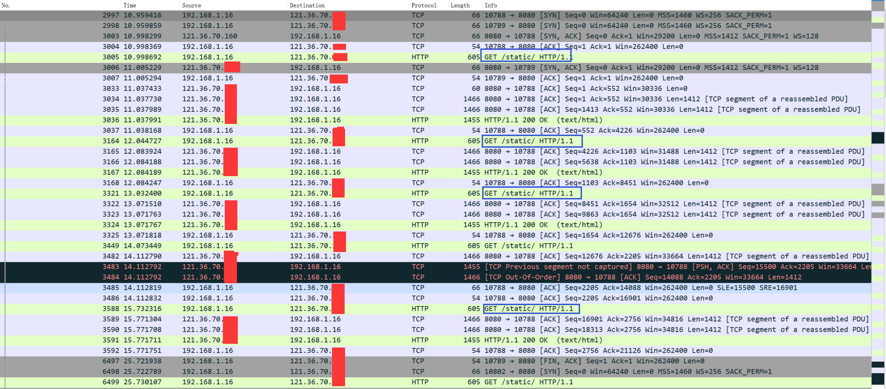
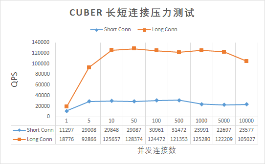
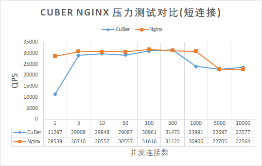
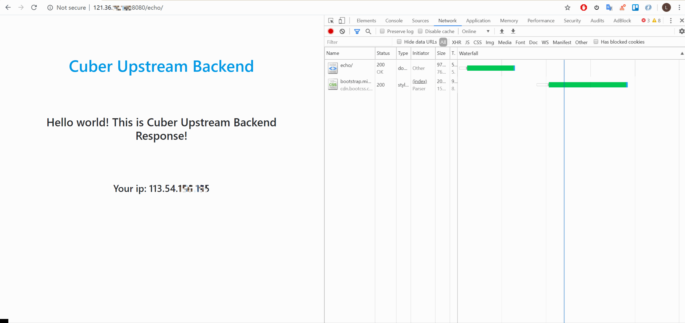

# CuBer

## Description

CuBer 是一个高并发的 HTTP 服务器，支持解析 HTTP get、put、post 请求，能够响应静态资源的请求，且支持反向代理，能够将动态内容请求转发到其他 web 服务器（如 uwsgi）。
CuBer 由 C++11 编写，采用 Reactor 事件处理模式高效处理非阻塞 IO， 并使用多线程提高并发能力。

## Introduction

Cuber 具备以下特性:

- Reactor 事件处理模式高效处理非阻塞 IO
- 多线程并发，充分利用多核处理器
- 支持 HTTP GET/HEAD method 以及 POST method（目前仅支持解析 identity-body，不支持 chuncked-body）
- 支持 HTTP 短连接及 HTTP 长连接
- 支持静态资源访问
- 支持 HTTP 反向代理（可连接 Django 等 web 后端）
- 长连接超时自动清除
- yaml 文件进行配置

## 测试结果

1. HTTP 长连接

    - Cuber 长连接请求抓包结果

        

2. 压力测试

    - 测试环境

       - 云服务器单机测试
       - 8vCPUs | Intel Cascade Lake 3.0GHz
       - 16GB 内存
       - 测试工具: Apache Bench (ab)
       - 详细配置信息参见: [pressure test info](vendor/pressure_test/readme.md)

    - CuBer 压力测试结果

        

    - CuBer、Nginx 的 Http 短连接压测结果

        

## CuBer 连接 Django 后端

1. Django 后端示例代码

    - 测试代码: [MakingL/CuberBackendApp](https://github.com/MakingL/CuberBackendApp)
    - 配置信息： [DjangoBackendExample readme](vendor/DjangoBackendExample/readme.md)
    - 运行结果:

        - Django Echo Client 源 IP

            

        - Django 计数器（HTTP POST 请求完成）

            

## 部署

### 方式一： Docker 部署

1. Dockerfile 构建

    - 在当前目录下（`CuBer/` 目录）， 运行 `docker build ./` 构建 docker 镜像
    - 运行构建好的 docker 镜像

### 方式二： 源码编译构建

1. 环境

    - Linux kernel version >= 2.6.28
    - cmake2.6 及以上版本
    - GCC >= 4.7

2. 安装编译工具

    - `sudo yum install make cmake gcc gcc-c++`

3. 构建编译

    - `cmake ./`
    - `make`

4. 按需求修改配置文件，示例配置文件为 `conf/cuber_full.yaml`

5. 运行 CuBer

    `./bin/CuBer -c conf/cuber.yaml` (其中的 `conf/cuber.yaml` 按照需求自行替换)

## 参考项目

1. [Github chenshuo/muduo](https://github.com/chenshuo/muduo)
2. [Github jbeder/yaml-cpp](https://github.com/jbeder/yaml-cpp)
