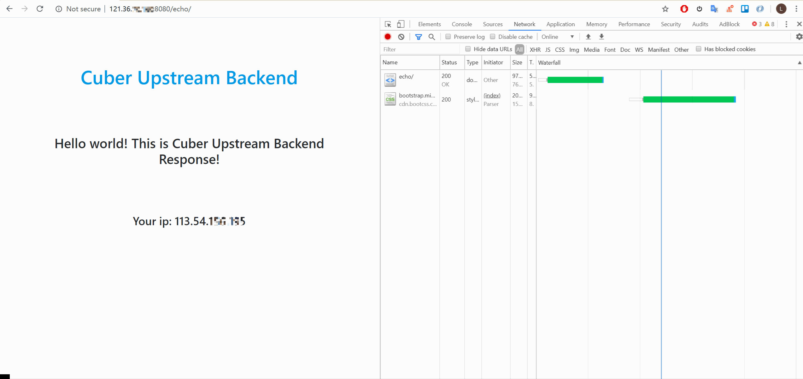
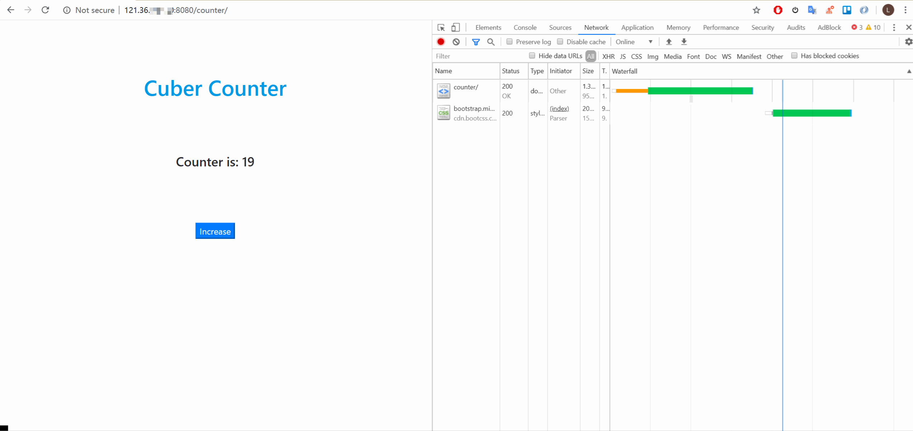

# CuBer Django Backend Example

## 配置文件

- CuBer 配置文件参见： [vendor/DjangoBackendExample/cuberDjangoExample.yaml](cuberDjangoExample.yaml)
- Djano 后端可直接用： [MakingL/CuberBackendApp](https://github.com/MakingL/CuberBackendApp) 的 Docker 部署

## 运行

- 先启动 CuberBackendApp，使其监听 8081 端口
- 运行 CuBer: `./bin/CuBer -c vendor/DjangoBackendExample/cuberDjangoExample.yaml`

## 访问地址

1. http://your_ip:8080/echo/ or http://127.0.0.1:8080/echo/
2. http://your_ip:8080/counter/ or http://127.0.0.1:8080/counter/

## 运行效果

- Django Echo Client 源 IP

    

- Django 计数器（HTTP POST 请求完成）

    
